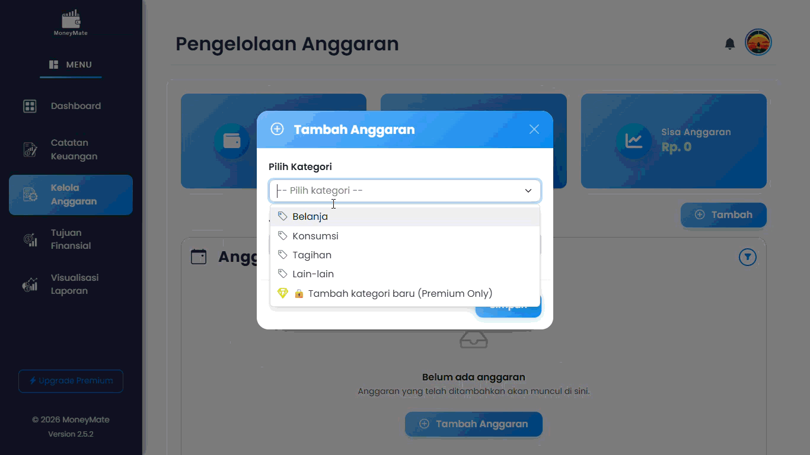

  

<b>Platform Web Interaktif untuk Manajemen Anggaran Harian & Analisis Keuangan</b>

---

## 📌 Deskripsi Aplikasi

**MoneyMate** adalah platform web interaktif yang dirancang untuk membantu pengguna mengelola anggaran harian secara efektif melalui pencatatan pemasukan dan pengeluaran, pengelompokan kategori, serta analisis keuangan dalam bentuk grafik dan laporan visual.

Dengan antarmuka yang sederhana namun informatif, MoneyMate memudahkan pengguna untuk:

* 📊 Memantau kondisi keuangan secara real-time
* 💳 Mengontrol pengeluaran
* 🎯 Merencanakan anggaran
* 💡 Mencapai tujuan finansial dengan lebih terarah

## 🖼️ Preview

  

  

  

  

  

---

# 🚀 Fitur Utama

---

## 1️⃣ Pencatatan Keuangan

### ✍️ Input Transaksi

Pengguna dapat mencatat:

* **Tanggal**
* **Jenis** (Pemasukan / Pengeluaran)
* **Kategori**
* **Nominal**
* **Keterangan**
* **Bukti Transaksi** (PNG/JPG)

Semua data tercatat dalam **Riwayat Transaksi** yang dapat:

* ✏️ Diedit
* 🗑️ Dihapus
* 🔍 Dicari melalui Search Box

### 📂 Kategori

* Versi Gratis → Hanya kategori bawaan
* Versi Berlangganan → Bisa membuat kategori kustom

### 💰 Ringkasan Otomatis

Menampilkan:

* Total Pemasukan
* Total Pengeluaran
* Total Saldo

### 🔎 Filter Data

* Per Hari Ini
* Per Minggu Ini
* Per Bulan Ini
* Periode Bulan Tertentu

### 🔒 Batasan Versi Gratis

* Maksimal total saldo Rp 6.000.000
* Jika melebihi, pengguna harus berlangganan

---

## 2️⃣ Pengelolaan Anggaran

### 📅 Penetapan Anggaran

* Anggaran ditentukan per kategori
* Berlaku dalam periode 1 bulan
* Terintegrasi dengan data pencatatan

### 📊 Perhitungan Otomatis

* Anggaran Terpakai
* Sisa Anggaran
* Total Anggaran Bulanan

### 🔄 Filter Anggaran

* Per Hari
* Per Minggu
* Per Bulan
  (Sistem otomatis membagi anggaran bulanan)

### 📁 Riwayat Anggaran

* Dapat melihat anggaran bulan sebelumnya
* Bisa diedit dan dihapus

Preview:

---

## 3️⃣ Tujuan Finansial (Goals Tracking)

### 🎯 Pembuatan Tujuan

Pengguna dapat menentukan:

* Nama Tujuan
* Target Nominal
* Deadline
* Nominal Saat Ini

### 🔁 Integrasi Otomatis

Saat memperbarui Nominal Saat Ini:

* Saldo berpindah dari Pencatatan ke Tujuan
* Progress bar & persentase otomatis terupdate

### 📊 Detail Tujuan

Menampilkan:

* Progress dalam %
* Sisa waktu menuju deadline
* Total tabungan terkumpul
* Total target keseluruhan
* Sisa target

### 🏁 Jika Target Tercapai

Pilihan:

1. **Pakai Tabungan** → Ditandai “Sudah Terpakai”
2. **Masukkan sebagai Pemasukan** → Kembali ke saldo pencatatan

### ❌ Jika Tujuan Dihapus

Pilihan:

* Hapus beserta catatan transaksi
* Kembalikan saldo sebagai pemasukan

### 🔒 Batasan Versi Gratis

* Hanya 1 Tujuan Finansial
* Versi berlangganan: Unlimited

---

## 4️⃣ Grafik & Visualisasi Data

### 🥧 Pie Chart – Distribusi Pengeluaran

* Per kategori
* Menampilkan persentase
* Filter:

  * Hari ini
  * Minggu ini
  * Bulan ini
  * Bulan tertentu
* Interaktif (bisa pilih kategori tertentu)

### 📊 Grafik Batang – Anggaran vs Pengeluaran

* Per kategori
* Warna merah jika melebihi anggaran
* Filter bulan tertentu
* Mode tampilan:

  * Anggaran Terpakai
  * Total Anggaran
  * Keduanya

---

## 5️⃣ Laporan Keuangan

Pengguna dapat mengunduh laporan dalam bentuk **PDF**.

### 📥 Versi Gratis

* Hanya 1 bulan per unduhan

### 💎 Versi Berlangganan

* Bisa pilih periode tertentu
  (contoh: Desember 2025 – Februari 2026)

---

## 6️⃣ Notifikasi

### 🔔 Pengingat Harian

* Pukul 20:00 WIB jika belum mencatat transaksi

### ⚠️ Peringatan Anggaran

* Hampir melewati
* Tepat batas
* Sudah melewati anggaran

### 📅 Ringkasan Bulanan

* Ringkasan penggunaan anggaran

Notifikasi dapat berupa:

* Push Notification dalam aplikasi
* Email pengguna

Notifikasi lebih dari 2 bulan otomatis terhapus.

---

## 7️⃣ Chatbot Finansial (Premium Only)

Fitur eksklusif untuk pengguna berlangganan.

### 🤖 Fungsi Chatbot:

* Mengklasifikasikan pengguna:

  * Frugal (Hemat)
  * Moderat (Seimbang)
  * Lavish (Boros)
* Memberikan rekomendasi berdasarkan kebiasaan finansial
* Merangkum:

  * Pencatatan
  * Anggaran
  * Tujuan Finansial

---

## 8️⃣ Profil Pengguna

### 👤 Manajemen Profil

* Edit data diri
* Pusat pengaturan aplikasi
* Status langganan

### 📊 Klasifikasi Finansial

* Frugal
* Moderat
* Lavish

### 🏅 Badge Pencapaian

Pengguna dapat memperoleh badge tertentu.

### 🔥 Streak Nyatat

Menampilkan konsistensi pencatatan harian pengguna.

---

# ⚙️ Pengaturan Aplikasi

* Pengaturan Notifikasi
* Pengaturan Email
* Preferensi Tampilan
* Manajemen Langganan
* Keamanan Akun
* Reset Data (opsional dengan konfirmasi)

---

# 🛡️ Fitur Non-Fungsional

### ⚡ Performa

* Respons cepat
* Optimasi query database
* Caching data penting

### 🔐 Keamanan

* Enkripsi data sensitif
* Proteksi terhadap serangan modern (XSS, CSRF, SQL Injection)
* Autentikasi & otorisasi berbasis role
* Validasi input

### 🎨 Usability

* UI/UX sederhana & intuitif
* Responsif (Desktop & Mobile)
* Navigasi mudah
* Informasi jelas & real-time

### 📈 Skalabilitas

* Siap untuk peningkatan jumlah pengguna
* Arsitektur modular

---

# 🏗️ Target Pengguna

* Pelajar
* Mahasiswa
* Pekerja
* Freelancer
* UMKM
* Ibu Rumah Tangga
* Awam Finansial
* Individu yang ingin mengelola keuangan pribadi dengan lebih baik

---

# 💎 Model Bisnis

| Fitur                     | Gratis    | Berlangganan |
| ------------------------- | ---------------------- | ------------------ |
| Kategori Kustom           | ❌                    | ✅                 |
| Maks Saldo Rp 6jt         | ✅                    | ❌                 |
| Tujuan Finansial          | 1                      | Unlimited          |
| Laporan Multi-Bulan       | ❌                    | ✅                 |
| Notifikasi Via Email & WA | Trial (hanya Email)    | ✅                |
| Upload Bukti Transaksi    | 30x uploads/month      | 120x uploads/month |
| Chatbot Finansial         | ❌                    | ✅                 |

---

# 🎯 Tujuan Proyek

MoneyMate bertujuan menjadi platform manajemen keuangan yang:

* Mudah digunakan
* Informatif
* Interaktif
* Aman
* Membantu pengguna mencapai stabilitas finansial

---

# 📌 Product Vision

**MoneyMate** merupakan aplikasi pencatat keuangan yang mengarah pada solusi manajemen finansial terintegrasi yang membantu pengguna di semua kalangan memahami kebiasaan keuangan, mengontrol anggaran, serta merencanakan masa depan finansial dengan lebih terarah.

---

## 🚀 Mulai Menggunakan Aplikasi
Aplikasi MoneyMate sepenuhnya berbasis web (*Web App*) sehingga Anda tidak perlu mengunduh apa pun di ponsel atau komputer Anda. Cukup klik tautan di bawah ini untuk masuk ke dashboard Anda:

👉 **[Buka Web App MoneyMate](https://app.moneymate.id)**

## 🌐 Terhubung dengan Kami (Media Sosial)
Ikuti perkembangan terbaru, tips mengelola uang, infografis finansial harian, serta pembaruan fitur menarik melalui saluran media sosial resmi kami:

* **Instagram:** [@moneymate_id](https://instagram.com/moneymate_id) – *Tips finansial harian, reels edukatif, dan info produk.*
* **TikTok:** [@moneymate.id](https://tiktok.com/@moneymate.id) – *Konten edukasi keuangan yang seru, singkat, dan menghibur.*
* **X (Twitter):** [@moneymateid](https://x.com/moneymateid) – *Diskusi keuangan harian, info cepat, dan customer support.*
* **LinkedIn:** [MoneyMate Indonesia](https://linkedin.com/company/moneymate-id) – *Informasi korporasi, karier, dan pembaruan industri.*
* **YouTube:** [MoneyMate ID Official](https://www.youtube.com/@moneymateofficial-id) – *Video tutorial mendalam dan webinar seputar literasi keuangan.*

---

## 🛠️ Dukungan & Masalah
Jika Anda mengalami kendala saat mengakses Web App di `app.moneymate.id` atau memiliki pertanyaan seputar layanan kami, silakan hubungi tim dukungan pelanggan melalui:
* Email: **support@moneymate.id**
* Halaman Hubungi Kami: [moneymate.id/contact](https://app.moneymate.id/kontak)

---

# 👨‍💻 Tim Pengembang

MoneyMate dikembangkan secara kolaboratif oleh tim multidisiplin yang berfokus pada pengembangan produk, pengalaman pengguna, kualitas perangkat lunak, serta strategi bisnis. Setiap anggota memiliki peran penting dalam mewujudkan MoneyMate sebagai platform manajemen keuangan yang modern, aman, dan mudah digunakan.

## 🧑‍💼 Project Leadership & Business Strategy

### **[Nurul Amalia Ramadhani](https://www.linkedin.com/in/nurul-amalia-ramadhani-020730278/)**
**Team Leader & Business Analyst**

**Kontribusi:**
- Memimpin keseluruhan pengembangan proyek MoneyMate.
- Menyusun product vision, roadmap, dan strategi pengembangan.
- Melakukan analisis kebutuhan pengguna serta kebutuhan bisnis.
- Menyusun dokumentasi kebutuhan sistem (Software Requirements).
- Menjadi penghubung antara kebutuhan bisnis dan implementasi teknis.

---

## 🎨 User Experience & Frontend Development

### **[Fauzan Alwan](https://www.linkedin.com/in/fauzan-alwan-87a568409/)**
**UI/UX Designer & Frontend Developer**

**Kontribusi:**
- Mendesain identitas visual dan antarmuka aplikasi.
- Merancang user flow serta pengalaman pengguna (UX).
- Mengimplementasikan desain menjadi antarmuka web yang responsif.
- Mengembangkan halaman dashboard, transaksi, anggaran, laporan, dan visualisasi data.
- Memastikan konsistensi desain pada seluruh halaman aplikasi.

---

## ⚙️ Backend Engineering & Infrastructure

### **[Daniel Charlie Samuel](https://www.linkedin.com/in/daniel-charlie-samuel-siburian-1a9a162a3/)**
**Fullstack Developer & Backend Support**

**Kontribusi:**
- Mengembangkan fitur backend dan integrasi dengan frontend.
- Mendesain struktur database dan API aplikasi.
- Mengimplementasikan autentikasi, otorisasi, dan pengelolaan data pengguna.
- Mendukung pengembangan fitur fullstack pada berbagai modul MoneyMate.
- Berkolaborasi dalam optimasi performa aplikasi.

### **[Asyraf Rais Fadhil](https://www.linkedin.com/in/asyraf-rais-fadhil/)**
**Backend Developer & DevOps Engineer**

**Kontribusi:**
- Mengembangkan layanan backend dan business logic aplikasi.
- Mengelola deployment, server, dan infrastruktur cloud.
- Mengoptimalkan keamanan aplikasi dan konfigurasi server.
- Mengelola pipeline deployment dan monitoring sistem.
- Menjaga stabilitas, skalabilitas, dan ketersediaan aplikasi.

---

## 🧪 Quality Assurance & Marketing

### **[Cahya Trixie Ariella](https://www.linkedin.com/in/cahya-trixie-ariella-sitorus-512779326/)**
**QA Tester & Marketing**

**Kontribusi:**
- Melakukan pengujian fungsionalitas seluruh fitur aplikasi.
- Menemukan, mendokumentasikan, dan memverifikasi perbaikan bug.
- Memastikan kualitas aplikasi sebelum proses rilis.
- Menyusun strategi pemasaran dan promosi MoneyMate.
- Mengelola komunikasi produk melalui media sosial dan branding.

---

## 🤝 Kolaborasi Tim

MoneyMate dikembangkan menggunakan pendekatan kolaboratif, di mana setiap anggota berkontribusi sesuai bidang keahliannya. Mulai dari analisis kebutuhan, perancangan UI/UX, pengembangan frontend dan backend, pengujian kualitas, hingga deployment serta strategi pemasaran dilakukan secara terintegrasi untuk menghadirkan pengalaman terbaik bagi pengguna.

With ❤️ by MoneyMate Teams

